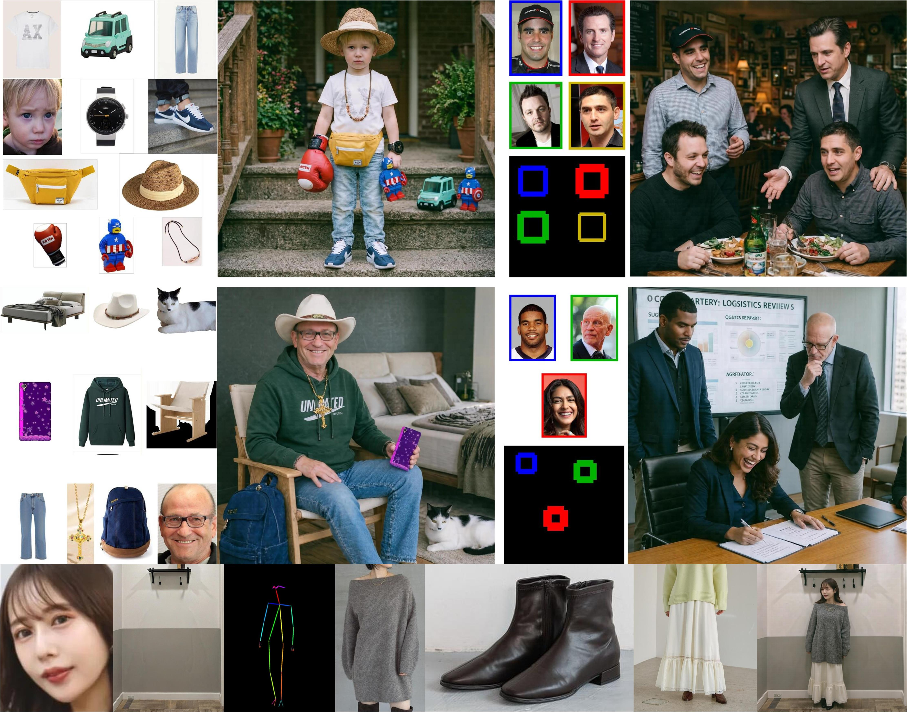

# o1.c

A native **C/CUDA inference engine** for the
[HiDream-O1-Image](https://huggingface.co/HiDream-ai) foundation image model.

<div align="center">
  <video src="https://github.com/user-attachments/assets/cbbdb816-f050-4685-aa51-4741479a0e5c" width="70%" poster=""> </video>
</div>

> **HiDream-O1-Image-Dev-2604 debuts at #8 in the Artificial Analysis Text to Image Arena, which is positioned to be the new leading open weights Text to Image model.**


<p align="center">
  
  <br><sub><b>General text-to-image generation</b> at up to 2,048 × 2,048.</sub>
</p>

<p align="center">
  
  <br><sub><b>Long-text rendering & layout control</b> — accurate, multi-region, multilingual text.</sub>
</p>

<p align="center">
  
  <br><sub><b>Subject-driven personalization</b> — preserve identity / IP across new scenes.</sub>
</p>

---

## 1. What is o1.c

o1.c re-implements the HiDream-O1-Image transformer in hand-written CUDA
kernels and runs it directly from a GGUF weight file. It is aimed at NVIDIA
GPUs and is validated on the GB10 (DGX Spark).

It supports **text-to-image**, **instruction-based image editing**,
**multi-reference personalization**, **layout/skeleton conditioning** and
**LoRA adapters**, all from the same binary, plus an optional
OpenAI-compatible HTTP server.

The engine is deterministic: the same prompt, seed and model produce the same
image every time.

## 2. Features

- **Text-to-image** at up to 2048×2048 (and other supported buckets).
- **Image editing** from a single reference image, with an instruction prompt.
- **Multi-reference personalization** with up to 20 references.
- **Named references** (`--ref-image NAME=PATH` + `@NAME` in the prompt).
- **Layout conditioning** with normalized bounding boxes.
- **Skeleton-guided composition** via ordered multi-reference inputs.
- **LoRA** adapters merged at load time.
- **OpenAI-compatible server** exposing `/v1/images/generations` and
  `/v1/images/edits`.
- **GGUF** weights, 256-byte aligned, loaded in one sequential stream.
- **Deterministic output** for a fixed prompt/seed/model.

## 3. Requirements / supported hardware

| Requirement | Minimum |
|-------------|---------|
| GPU | NVIDIA GPU; validated on GB10 (DGX Spark), compute capability 12.1 |
| Driver | a driver able to run the installed CUDA toolkit (580.x validated) |
| CUDA toolkit | 13.0 validated (`nvcc`, headers, `libcudart`) |
| cuBLAS / cuBLASLt | shipped with the CUDA toolkit |
| cuDNN | 9.x (9.20 validated) |
| Compiler | C11 + C++17 host compiler (gcc 13.3 validated) |
| `make` | GNU make |
| Disk | ≈ 18 GB per BF16 model |
| VRAM | ≈ 0.9 GB (T2I 2048) to ≈ 5.2 GB (Base 2048) reported RSS |

Run `./scripts/setup.sh` to check all of these at once. See
[Installation](#5-installation).

## 4. Quick start

```sh
git clone https://github.com/luca-saggese/o1.c.git
cd o1.c

./scripts/setup.sh                 # check your environment
source scripts/env.sh              # resolve CUDA / cuDNN paths
make                               # build build/hidream

./scripts/download_model.sh dev-2604

./build/hidream --model-path models/hidream-o1-dev-2604-bf16.gguf \
    --prompt "a red fox in a snowy forest, golden hour" \
    --width 2048 --height 2048 --seed 42 --output fox.png
```

## 5. Installation

### 5.1 Check the environment

```sh
./scripts/setup.sh
```

This validates the GPU, compute capability, driver, `nvcc`, CUDA headers,
`libcudart`, cuBLAS, cuBLASLt, cuDNN, the compiler and `make`. It only
reports; it never installs anything. If something is missing it prints exactly
what to do.

### 5.2 Resolve library paths

```sh
source scripts/env.sh
```

This resolves `CUDA_HOME` and `CUDNN_HOME` from standard locations (or honours
existing overrides) and exports `PATH` and `LD_LIBRARY_PATH`. It is safe to
source repeatedly.

If cuDNN lives somewhere unusual, point at it explicitly:

```sh
export CUDNN_HOME=/path/to/cudnn
source scripts/env.sh
```

cuDNN 9.x can be installed without root via
`pip install nvidia-cudnn-cu13`, or from the NVIDIA native tarball into
`/usr/local/cudnn`. Both are detected automatically. See
[`docs/SETUP.md`](docs/SETUP.md) for details.

### 5.3 Build

```sh
make            # build/hidream
make server     # build/hidream-server (optional)
```

## 6. Download a model

```sh
./scripts/download_model.sh dev-2604     # recommended
./scripts/download_model.sh dev
./scripts/download_model.sh base
```

The script reads [`models/manifest.json`](models/manifest.json), downloads
from Hugging Face, supports resume, shows progress, **verifies SHA256** and
fails on a checksum mismatch. It prints the exact `--model-path` command to
use when it finishes.

Useful options:

```sh
./scripts/download_model.sh list                 # show available models
./scripts/download_model.sh dev-2604 --dir /data # choose destination
./scripts/download_model.sh dev-2604 --force     # re-download
```

Available models:

| id | Model | Steps | Size |
|----|-------|-------|------|
| `dev-2604` | HiDream-O1-Image-Dev-2604 | 28 | 17.6 GB |
| `dev` | HiDream-O1-Image-Dev | 28 | 17.6 GB |
| `base` | HiDream-O1-Image (Base/Full) | 50 | 17.6 GB |

The artifacts are published at
[`saggeseluca/o1.c-models`](https://huggingface.co/saggeseluca/o1.c-models)
on Hugging Face. The download script reads the URLs and checksums from
[`models/manifest.json`](models/manifest.json) — no URL is hard-coded in the
script, so you never need to know the repository path by hand.

**Q4 is not available.** The runtime currently supports only F32/F16/BF16
GGUF tensors, so there is no quantized release yet. Do not expect Q4 files.

## 7. Generate an image

```sh
./build/hidream --model-path models/hidream-o1-dev-2604-bf16.gguf \
    --prompt "A serene mountain lake at sunrise, photorealistic" \
    --width 2048 --height 2048 --steps 28 --seed 42 \
    --output lake.png
```

Use the model's default step count unless you have a reason to change it
(28 for Dev, 50 for Base). For text-to-image, `--steps 1` is a useful execution
smoke test, but its image is not a real generation. Edit and personalization
modes need a full schedule: very low step counts produce out-of-range latents
and are rejected rather than written out.

## 8. Edit an image

Pass a reference image and an instruction prompt:

```sh
./build/hidream --model-path models/hidream-o1-dev-2604-bf16.gguf \
    --mode edit \
    --ref-image example_assets/edit/test.jpg \
    --prompt "remove the earphones" \
    --width 2048 --height 2048 --steps 28 --seed 42 \
    --output edit.png
```

To keep the source aspect ratio instead of forcing the requested size:

```sh
./build/hidream --model-path models/hidream-o1-dev-2604-bf16.gguf \
    --mode edit \
    --ref-image example_assets/edit/test.jpg \
    --keep-original-aspect \
    --prompt "remove the earphones" \
    --steps 28 --seed 42 \
    --output edit-aspect.png
```

## 9. Multi-reference personalization

Pass several references; they are combined into one coherent subject:

```sh
./build/hidream --model-path models/hidream-o1-dev-2604-bf16.gguf \
    --mode personalize \
    --ref-image example_assets/IP/1.jpg \
    --ref-image example_assets/IP/2.jpg \
    --ref-image example_assets/IP/3.jpg \
    --prompt "Create a coherent portrait using the supplied subject references." \
    --width 2048 --height 2048 --steps 28 --seed 42 \
    --output personalize.png
```

References can be **named** and referred to in the prompt with `@name`:

```sh
./build/hidream --model-path models/hidream-o1-dev-2604-bf16.gguf \
    --mode personalize \
    --ref-image person=person.jpg \
    --ref-image shirt=shirt.jpg \
    --prompt '@person wearing @shirt' \
    --steps 28 --seed 42 --output outfit.png
```

Every reference also gets an automatic alias `@ref1`, `@ref2`, … by position.
An unknown `@token` is left verbatim in the prompt rather than failing. Use
`--verbose` to print the alias mapping.

## 10. Layout / skeleton conditioning

**Layout.** Provide normalized `[x_min, x_max, y_min, y_max]` boxes, one per
reference, in the same order:

```sh
./build/hidream --model-path models/hidream-o1-dev-2604-bf16.gguf \
    --mode layout \
    --ref-image person=example_assets/IP_layout/0.jpg \
    --ref-image object=example_assets/IP_layout/1.jpg \
    --layout-bboxes "[[0.205,0.439,0.488,0.742],[0.576,0.801,0.088,0.342]]" \
    --prompt "@person and @object arranged according to the supplied layout." \
    --width 2048 --height 2048 --steps 28 --seed 42 \
    --output layout.png
```

**Skeleton.** Skeleton conditioning is ordered multi-reference personalization
using face, background, pose and body-part references:

```sh
./build/hidream --model-path models/hidream-o1-dev-2604-bf16.gguf \
    --mode personalize \
    --ref-image example_assets/IP_skeleton/0.face.jpg \
    --ref-image example_assets/IP_skeleton/0.bg.jpg \
    --ref-image example_assets/IP_skeleton/0.openpose.jpg \
    --ref-image example_assets/IP_skeleton/0.part_1.jpg \
    --ref-image example_assets/IP_skeleton/0.part_2.jpg \
    --ref-image example_assets/IP_skeleton/0.part_3.jpg \
    --prompt "Create a realistic try-on image of the person wearing the provided clothing." \
    --width 2048 --height 2048 --steps 28 --seed 42 \
    --output skeleton.png
```

## 11. Model variants

| Variant | GGUF | Profile | Default steps | Guidance | Shift | Scheduler |
|---------|------|---------|---------------|----------|-------|-----------|
| Dev-2604 | `hidream-o1-dev-2604-bf16.gguf` | `dev` | 28 | 0 | 1 | flash |
| Dev | `hidream-o1-dev-bf16.gguf` | `dev` | 28 | 0 | 1 | flash |
| Base/Full | `hidream-o1-base-bf16.gguf` | `base` | 50 | 5 | 3 | default (UniPC) |

Dev-2604 and Dev share the same execution profile but are distinct
checkpoints. Base requires its full 50-step schedule; a short recipe will not
produce a valid image.

The engine reads the execution profile from the GGUF metadata, so
`--model-path` alone is enough — you never select a profile by hand.

## 12. CLI reference

```
build/hidream [options]

  --model-path PATH       production GGUF model file (profile inferred
                          from GGUF metadata; this is the public interface)
  --prompt TEXT           user prompt
  --mode t2i|edit|personalize|layout|...   generation mode (default: t2i)
  --ref-image PATH        reference image (repeatable, max 20)
  --ref-image NAME=PATH   named reference; use @NAME in --prompt
  --keep-original-aspect  single ref: derive output dims from ref
  --layout-bboxes JSON    layout bboxes for personalize+layout
  --verbose               print reference alias mapping / expanded prompt
  --no-progress           disable the generation progress bar
  --width N               output width (default: 1024)
  --height N              output height (default: 1024)
  --steps N               inference steps (default per model profile)
  --seed N                RNG seed (default: 123456)
  --scheduler flash|default|flow_match   (default per model profile)
  --guidance F            CFG scale (default per model profile)
  --shift F               scheduler shift (default per model profile)
  --output PATH           output PNG path (default: output.png)
  --device N              CUDA device index (default: 0)
  --noise-start F         noise_scale_start (default: 8.0)
  --noise-end F           noise_scale_end (default: 8.0)
  --noise-clip F          noise_clip_std (default: 8.0)
  --lora FILE[:MULT]      apply LoRA adapter (repeatable)
  -h, --help              show this help
```

Sizes are snapped to supported buckets; `1024x1024` is not a bucket. Requests
are aligned to the model's patch grid.

## 13. LoRA

Apply one or more adapters, optionally scaled:

```sh
./build/hidream --model-path models/hidream-o1-dev-2604-bf16.gguf \
    --lora my-style.safetensors:0.8 \
    --prompt "a portrait in my style" \
    --steps 28 --seed 42 --output lora.png
```

Adapters are merged into the weights at load time (`W' = W + mult · (α/r) ·
up·down`), so there is no runtime cost. Only linear targets are supported;
unsupported adapters fail explicitly rather than being partially applied.
See [`docs/LORA_IMPLEMENTATION.md`](docs/LORA_IMPLEMENTATION.md).

## 14. Server / OpenAI-compatible API

`build/hidream-server` keeps **one model resident** and serves the same engine
over an OpenAI-compatible Images API.

```sh
source scripts/env.sh

./build/hidream-server --port 8000 \
    --model-path models/hidream-o1-dev-2604-bf16.gguf
```

<<<<<<< HEAD
=======
Every reference also gets an automatic alias `@refN` (N = 1-based position on
the command line), so `@ref1`, `@ref2`, … always work, with or without an
explicit name:

```sh
./build/hidream --model dev --mode personalize \
  --ref-image face.jpg --ref-image clothes.jpg \
  --prompt 'Use the identity from @ref1 and the clothes from @ref2' \
  --steps 28 --seed 123456 --output out.png
```

Key points:

- `@name` is a **prompt-side alias only**. It does **not** add a new model
  token, change the tokenizer vocabulary, or modify the reference image
  encoding. Aliases are expanded away before tokenization.
- References retain their **original command-line order**; aliases never
  reorder the reference tensors, `ref_patches`, `image_embeds` or DeepStack.
- A prompt with **no** `@alias` is used byte-identically (the reference
  mapping header is only injected when at least one alias is present).
- Invalid aliases fail closed: duplicates (`duplicate reference alias: x`),
  empty/whitespace names and reserved names starting with `__` are rejected.
  An **unknown** `@token` in the prompt is **not** an error: it is left
  verbatim in the prompt (e.g. `@foo` stays `@foo`).
- Alias grammar: `[A-Za-z_][A-Za-z0-9_-]*` (e.g. `person`, `person_1`,
  `dress-blue`, `pose_front`). `--ref-image a/b=c/d.png` keeps the whole
  string as a path because `a/b` is not a valid alias.
- The mapping is printed with `--verbose` (or `O1_VERBOSE_REF=1`).
- C API: `hd_reference_image.alias` (optional, `NULL` for none) selects the
  same behaviour programmatically.

## Generation progress

When `stderr` is a TTY, generation prints an in-place progress bar for the
denoise loop, with elapsed time and an estimate of the remaining time:

```text
[########------------------]  32% step 9/28  00:12 elapsed  00:25 left
```

- Progress is measured per denoise step, so the fraction is `step/total` and
  the estimate extrapolates linearly from the average step duration.
- The bar is purely frontend: it is driven by `hd_generation_request.progress_cb`.
  It never allocates, synchronizes or touches device state.
- It is disabled automatically when `stderr` is not a TTY (so logs and pipes
  stay clean) and can be turned off explicitly with `--no-progress`.

## Generation examples

The repository includes sample inputs and generated outputs under
[`example_example_assets/`](example_example_assets/). Run the commands below from the
repository root after building `build/hidream`.

| Feature | Mode/options | Input example_assets | Verified output |
|---------|--------------|--------------|-----------------|
| Text-to-image | `--mode t2i` | prompt only | — |
| Instruction-based editing | `--mode edit` | [`edit/test.jpg`](example_example_assets/edit/test.jpg) | [`edit/generated.png`](example_example_assets/edit/generated.png) |
| Multi-reference personalization | `--mode personalize` | [`IP/1.jpg` … `IP/10.jpg`](example_example_assets/IP/) | — |
| Skeleton-guided composition | `--mode personalize` with face, background, pose and part references | [`IP_skeleton/`](example_example_assets/IP_skeleton/) | — |
| Personalization with layout | `--mode layout --layout-bboxes` | [`IP_layout/0.jpg`](example_example_assets/IP_layout/0.jpg), [`IP_layout/1.jpg`](example_example_assets/IP_layout/1.jpg) | — |
| Preserve source aspect ratio | `--keep-original-aspect` | [`edit/test.jpg`](example_example_assets/edit/test.jpg) | — |

The examples use the materialized Dev GGUF at
`artifacts/models/hidream-o1-dev-bf16.gguf`. Omit `--model-dir` to use the
path configured by the selected profile.

> **Use the full Dev schedule for image-quality examples.** `--steps 1` is
> useful only as an execution smoke test; its decoded image may be uniform
> mid-gray and must not be treated as a generated result. The commands below
> therefore use the Dev default of 28 steps.

### Text-to-image (Dev)

```sh
./build/hidream --model dev \
  --model-dir artifacts/models/hidream-o1-dev-bf16.gguf \
  --prompt "A dog holds a sign that says HiDream-O1-Image release." \
  --width 2048 --height 2048 --steps 28 --seed 42 \
  --output t2i-dev-output.png
```

### Text-to-image (Base + FlowUniPC/CFG)

The Base profile selects the 50-step default FlowUniPC scheduler and CFG:

```sh
./build/hidream --model base \
  --prompt "A cinematic portrait in soft natural light." \
  --width 2048 --height 2048 --steps 50 --seed 42 \
  --output t2i-base-output.png
```

### Instruction-based editing

```sh
./build/hidream --model dev \
  --model-dir artifacts/models/hidream-o1-dev-bf16.gguf \
  --mode edit \
  --ref-image example_example_assets/edit/test.jpg \
  --prompt "remove the earphones" \
  --width 2048 --height 2048 --steps 28 --seed 123456 \
  --output edit-output.png
```

### Multi-reference personalization

```sh
./build/hidream --model dev \
  --model-dir artifacts/models/hidream-o1-dev-bf16.gguf \
  --mode personalize \
  --ref-image example_example_assets/IP/1.jpg \
  --ref-image example_example_assets/IP/2.jpg \
  --ref-image example_example_assets/IP/3.jpg \
  --ref-image example_example_assets/IP/4.jpg \
  --ref-image example_example_assets/IP/5.jpg \
  --ref-image example_example_assets/IP/6.jpg \
  --ref-image example_example_assets/IP/7.jpg \
  --ref-image example_example_assets/IP/8.jpg \
  --ref-image example_example_assets/IP/9.jpg \
  --ref-image example_example_assets/IP/10.jpg \
  --prompt "Create a coherent portrait using the supplied subject references." \
  --width 2048 --height 2048 --steps 28 --seed 42 \
  --output personalize-output.png
```

References may also be named and used in the prompt with the
[`@alias` syntax](#named-reference-images).

### Skeleton-guided multi-reference composition

Skeleton conditioning uses the face, background, OpenPose and body-part
images as an ordered multi-reference personalization request:

```sh
./build/hidream --model dev \
  --model-dir artifacts/models/hidream-o1-dev-bf16.gguf \
  --mode personalize \
  --ref-image example_example_assets/IP_skeleton/0.face.jpg \
  --ref-image example_example_assets/IP_skeleton/0.bg.jpg \
  --ref-image example_example_assets/IP_skeleton/0.openpose.jpg \
  --ref-image example_example_assets/IP_skeleton/0.part_1.jpg \
  --ref-image example_example_assets/IP_skeleton/0.part_2.jpg \
  --ref-image example_example_assets/IP_skeleton/0.part_3.jpg \
  --prompt "Create a realistic try-on image of the person wearing the provided clothing." \
  --width 2048 --height 2048 --steps 28 --seed 42 \
  --output skeleton-output.png
```

### Personalization with layout

Bounding boxes use normalized `[x_min, x_max, y_min, y_max]` coordinates and
follow the same order as the reference images:

```sh
./build/hidream --model dev \
  --model-dir artifacts/models/hidream-o1-dev-bf16.gguf \
  --mode layout \
  --ref-image person=example_example_assets/IP_layout/0.jpg \
  --ref-image object=example_example_assets/IP_layout/1.jpg \
  --layout-bboxes "[[0.20507812,0.43945312,0.48828125,0.7421875],[0.57617188,0.80078125,0.08789062,0.34179688]]" \
  --prompt "@person and @object arranged according to the supplied layout." \
  --width 2048 --height 2048 --steps 28 --seed 42 \
  --output layout-output.png
```

### Preserve the original aspect ratio

With one reference, `--keep-original-aspect` derives patch-aligned output
dimensions from the source image:

```sh
./build/hidream --model dev \
  --model-dir artifacts/models/hidream-o1-dev-bf16.gguf \
  --mode edit \
  --ref-image example_example_assets/edit/test.jpg \
  --keep-original-aspect \
  --prompt "remove the earphones" \
  --steps 28 --seed 42 \
  --output edit-keep-aspect-output.png
```

See [`example_example_assets/README.md`](example_example_assets/README.md) for attribution,
additional context and the upstream prompts associated with these example_assets.

## Server / OpenAI-compatible Images API

`build/hidream-server` exposes the same generation engine as the CLI through
an OpenAI-compatible Images API. It keeps **one model resident**: the weights
are loaded once at startup and every request reuses them, so request latency
is the generation itself, not a model reload.

### Startup

```sh
export LD_LIBRARY_PATH=/home/lvx/.local/lib/python3.12/site-packages/nvidia/cudnn/lib:$LD_LIBRARY_PATH

./build/hidream-server --port 8000 --model dev
```

Options:

| Option | Default | Meaning |
|--------|---------|---------|
| `--host HOST` | `127.0.0.1` | Listen address |
| `--port N` | `8000` | TCP port |
| `--model dev\|base` | `dev` | Profile to load and keep resident |
| `--model-dir PATH` | per-profile GGUF | Weights directory or `.gguf` pack |
| `--api-key SECRET` | none | Require `Authorization: Bearer SECRET` |
| `--cors` | off | Emit permissive CORS headers, answer `OPTIONS` with 204 |
| `--queue-depth N` | `8` | Maximum *waiting* jobs before `429 queue_full` |
| `--max-body-mb N` | `64` | Maximum request body size (`413` beyond it) |
| `--device N` | `0` | CUDA device index |
| `--lora FILE[:MULT]` | none | Merge a LoRA adapter at startup (repeatable) |

At shutdown (`SIGINT`/`SIGTERM`) the server stops accepting, drains the
in-flight request, then prints the preload-lifecycle release gate to stderr:

```text
hidream-server: shutting down
hidream-server: lifecycle open=1 weight_load=1 forward_resolve=1 vision_resolve=1 requests=2 close=1
```

### Endpoints

| Method | Path | Purpose |
|--------|------|---------|
| `GET` | `/healthz` | Liveness + loaded profile |
| `GET` | `/v1/models` | Advertises the resident model id |
| `POST` | `/v1/images/generations` | JSON text-to-image |
| `POST` | `/v1/images/edits` | `multipart/form-data`, reference images |

### Supported fields

Standard OpenAI fields: `prompt`, `model`, `n` (1–4), `size`, `quality`
(`auto` only), `response_format` (`b64_json` only), `output_format` (`png`
only), `background` (`auto`/`opaque`), `user`, and — on edits — `image` /
`image[]` plus `mask` (rejected).

Engine-specific fields (prefixed `o1_`):

| Field | Meaning |
|-------|---------|
| `o1_mode` | `t2i`, `edit`, `personalize`/`multi-ref`, `personalize_layout`/`layout` |
| `o1_seed` | 64-bit seed; with `n>1` image *i* uses `seed+i` |
| `o1_steps` | Denoising steps (1–64) |
| `o1_guidance_scale`, `o1_shift` | Sampler overrides |
| `o1_scheduler` | `flash`, `flow_match`, `default`/`unipc` |
| `o1_noise_start`, `o1_noise_end`, `o1_noise_clip` | Noise schedule overrides |
| `o1_keep_original_aspect` | Derive output dims from a single reference |
| `o1_exact_size` | Fail instead of snapping to a supported bucket |
| `o1_reference_aliases` | JSON array, one `@name` per input image |
| `o1_layout_bboxes` | Layout description for `personalize_layout` |
| `o1_verbose` | Log the reference mapping and expanded prompt to stderr |

### Known unsupported fields

`mask` (`mask_not_supported`), `background=transparent`
(`unsupported_background`), any `output_format` other than `png`
(`unsupported_output_format`), `response_format=url`, `compression`,
`quality` presets, and per-request `o1_lora` (adapters are startup-global).
`o1_mode=personalize_skeleton` is rejected: skeleton conditioning is not
implemented by the server.

### Resolution snapping

The engine only generates at frozen buckets (`2048x2048`, `2304x1728`,
`1728x2304`, `2560x1440`, …). A requested `size` is snapped to the nearest
bucket and the server logs the substitution:

```text
hidream-server: request size 1024x1024 snapped to 2048x2048
```

`1024x1024` is **not** a bucket. Pass `o1_exact_size: true` to fail with
`400 unsupported_size` instead of snapping.

### curl examples

```sh
# Text to image
curl -s http://127.0.0.1:8000/v1/images/generations \
  -H 'Content-Type: application/json' \
  -d '{"model":"hidream-o1-image-dev","prompt":"a red apple on a wooden table",
       "size":"2048x2048","o1_seed":42,"o1_steps":28}' \
  | python3 -c 'import sys,json,base64;open("out.png","wb").write(base64.b64decode(json.load(sys.stdin)["data"][0]["b64_json"]))'

# Edit (single reference)
curl -s http://127.0.0.1:8000/v1/images/edits \
  -F model=hidream-o1-image-dev \
  -F prompt='remove the earphones' \
  -F o1_mode=edit -F o1_seed=7 \
  -F image=@example_example_assets/edit/test.jpg \
  -o edit.json

# Multi-reference personalization with named references
curl -s http://127.0.0.1:8000/v1/images/edits \
  -F model=hidream-o1-image-dev \
  -F prompt='a photo of @subject in the style of @style' \
  -F o1_mode=personalize \
  -F 'o1_reference_aliases=["subject","style"]' \
  -F image=@example_example_assets/IP_2.jpg \
  -F image=@example_example_assets/edit/test.jpg \
  -o multiref.json
```

| Option | Default | Meaning |
|--------|---------|---------|
| `--host HOST` | `127.0.0.1` | Listen address |
| `--port N` | `8000` | TCP port |
| `--model-path PATH` | — | Production GGUF model file |
| `--api-key SECRET` | none | Require an `Authorization` header |
| `--cors` | off | Permissive CORS headers |
| `--queue-depth N` | `8` | Max waiting jobs before `429` |
| `--max-body-mb N` | `64` | Max request body size |
| `--device N` | `0` | CUDA device index |
| `--lora FILE[:MULT]` | none | Merge a LoRA adapter at startup |

Engine-specific request fields are prefixed `o1_` (`o1_seed`, `o1_steps`,
`o1_mode`, `o1_guidance_scale`, `o1_shift`, `o1_scheduler`,
`o1_reference_aliases`, `o1_layout_bboxes`, …). `response_format` must be
`b64_json` and `output_format` must be `png`.

## 15. Performance expectations

On a GB10 (DGX Spark), with the model loaded:

| Workload | Recipe | Wall clock |
|----------|--------|-----------|
| Text-to-image | 2048×2048, 28 steps | ≈ 86 s |
| Edit (1 reference) | 2048×2048, 28 steps | ≈ 196 s |
| Text-to-image (Base) | 2048×2048, 50 steps, CFG | ≈ 320 s |

Model loading is separate (a few seconds from a GGUF) and happens once per
process. The server loads once and reuses the resident model for every
request. Edit is slower than text-to-image because the reference's pixel
tokens are appended to the denoiser sequence at every step.

See [`docs/PERFORMANCE.md`](docs/PERFORMANCE.md) for the full breakdown.

## 16. Troubleshooting

**`error while loading shared libraries: libcudnn.so.9`**
cuDNN is not on the loader path. Run `source scripts/env.sh`, or export
`LD_LIBRARY_PATH="$CUDNN_HOME/lib:$LD_LIBRARY_PATH"`. Confirm with
`ldd build/hidream | grep cudnn`.

**`cudnn.h: No such file or directory` / cuDNN not found at build time**
cuDNN is not installed or not detected. Run `./scripts/setup.sh`, install
cuDNN 9.x (`pip install nvidia-cudnn-cu13`), or set
`CUDNN_HOME=/path/to/cudnn`.

**`nrmse` / `test_full_forward` failure from `make test`**
This is a known, pre-existing numerical exception in the test suite. It does
not affect production generation. Run individual test targets if you need to
bypass it.

**Generation is very slow the first time**
The first run includes CUDA module loading and cuDNN plan construction.
Subsequent runs in the same process are faster.

**`final latent range … out of bounds` with Base**
Base requires its full 50-step schedule with CFG. Do not shorten it.

**Output size differs from `--width`/`--height`**
Sizes snap to supported buckets (multiples of the patch grid). `1024x1024` is
not a bucket.

## 17. Building from source

```sh
./scripts/setup.sh
source scripts/env.sh
make            # build/hidream
make server     # build/hidream-server
make test       # build the native test suite
make clean
```

`CUDNN_HOME` and `CUDA_HOME` are auto-detected; override them if needed:

```sh
make CUDNN_HOME=/opt/cudnn
```

The build targets `-arch=sm_121` by default. Engineering details, test
targets and the internal safetensors development path are documented in
[`docs/DEVELOPMENT.md`](docs/DEVELOPMENT.md),
[`docs/ARCHITECTURE.md`](docs/ARCHITECTURE.md) and
[`docs/SETUP.md`](docs/SETUP.md).

## 18. Model provenance / acknowledgements

The model weights are the work of **[HiDream-ai](https://huggingface.co/HiDream-ai)**.
o1.c only converts them to GGUF and provides a native runtime. This project
does not replace the upstream model repository — please use it for the
authoritative model cards and citation.

| Release GGUF | Source repository | Revision | License |
|--------------|-------------------|----------|---------|
| `hidream-o1-dev-2604-bf16.gguf` | `HiDream-ai/HiDream-O1-Image-Dev-2604` | `b6acc2fe…` | MIT |
| `hidream-o1-dev-bf16.gguf` | `HiDream-ai/HiDream-O1-Image-Dev` | `c0bada0e…` | MIT |
| `hidream-o1-base-bf16.gguf` | `HiDream-ai/HiDream-O1-Image` | `0b0901d9…` | MIT |

The GGUF conversions are redistributed from
[`saggeseluca/o1.c-models`](https://huggingface.co/saggeseluca/o1.c-models),
which is **not** a replacement for the upstream repositories. See
[`docs/RELEASE_MODELS.md`](docs/RELEASE_MODELS.md) for full provenance and
reproduction commands.

## 19. License

The engine source is provided as-is for use with the HiDream-O1-Image models.
Model weights remain subject to the **upstream license (MIT)** and are not
redistributed in this repository; use `scripts/download_model.sh` or the
upstream Hugging Face repositories.
=======
