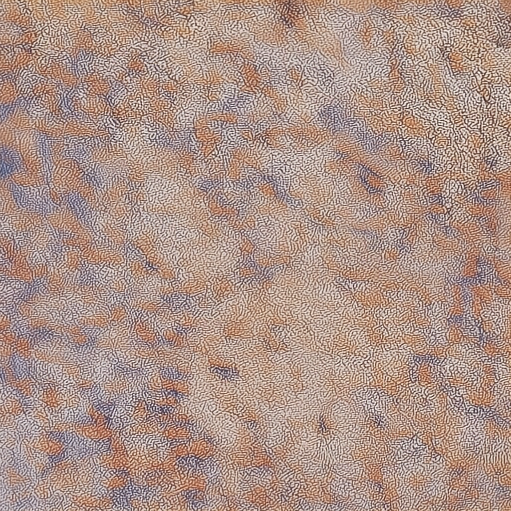

# Example assets

Sample images and documents used by the native `o1.c` generation examples.

## Attribution

These assets are copied verbatim from the upstream
[HiDream-ai/HiDream-O1-Image](https://github.com/HiDream-ai/HiDream-O1-Image)
repository (`assets/` directory), which is licensed under the
[Apache-2.0](https://github.com/HiDream-ai/HiDream-O1-Image/blob/main/LICENSE)
license. The upstream checkout used as the reference is kept in
`_reference/` (git-ignored).

| Directory | Contents | Used by |
|-----------|----------|---------|
| `edit/` | single reference image for instruction-based editing | `--mode edit` |
| `IP/` | 10 subject reference images for multi-reference personalization | `--mode personalize` |
| `IP_layout/` | 2 reference images + layout bboxes | `--mode personalize --layout-bboxes` |
| `IP_skeleton/` | face / background / openpose / part images (multi-reference skeleton) | `--mode personalize` |
| `generated/` | sanity outputs produced by the native CLI (git-committed) | — |

## Generation examples

All examples use the native binary `./build/hidream` with the materialized
GGUF weight pack. They mirror the upstream README examples (same assets and
prompts where sensible) but use only native `o1.c` flags.

> **Note on steps**: use the complete Dev schedule (`--steps 28`) for a
> meaningful image. A one-step run is only an execution smoke test and may
> decode to uniform mid-gray; it is not a generation-quality result.

### Text-to-Image

```sh
./build/hidream --model dev \
  --model-dir artifacts/models/hidream-o1-dev-bf16.gguf \
  --prompt "A dog holds a sign that says HiDream-O1-Image release." \
  --width 1024 --height 1024 --steps 28 --seed 42 \
  --output t2i-dev-output.png
```

### Instruction-Based Image Editing

```sh
./build/hidream --model dev \
  --model-dir artifacts/models/hidream-o1-dev-bf16.gguf \
  --mode edit \
  --ref-image example_assets/edit/test.jpg \
  --prompt "remove the earphones" \
  --width 1024 --height 1024 --steps 28 --seed 123456 \
  --output edit-output.png
```

Verified 28-step output:



### Multi-Reference Subject-Driven Personalization

```sh
./build/hidream --model dev \
  --model-dir artifacts/models/hidream-o1-dev-bf16.gguf \
  --mode personalize \
  --ref-image example_assets/IP/1.jpg --ref-image example_assets/IP/2.jpg \
  --ref-image example_assets/IP/3.jpg --ref-image example_assets/IP/4.jpg \
  --ref-image example_assets/IP/5.jpg --ref-image example_assets/IP/6.jpg \
  --ref-image example_assets/IP/7.jpg --ref-image example_assets/IP/8.jpg \
  --ref-image example_assets/IP/9.jpg   --ref-image example_assets/IP/10.jpg \
  --prompt "A young boy with blonde hair stands on steps wearing light blue jeans, a white t-shirt with logo, and blue and white sneakers. He wears a brown cord necklace with beads, a black wristwatch with digital display, and carries a yellow fanny pack with white zipper. In his hand is a red boxing glove with white top, a teal plastic toy car, and a plastic toy figure of Captain America. He wears a straw hat with cream band. Natural light illuminates the scene." \
  --width 1024 --height 1024 --steps 28 --seed 42 \
  --output personalize-output.png
```

### Multi-Reference Personalization + Skeleton

Upstream represents skeleton conditioning as a multi-reference input
(face + background + openpose + parts) — there is no separate conditioning
path. The native engine follows the same semantics.

```sh
./build/hidream --model dev \
  --model-dir artifacts/models/hidream-o1-dev-bf16.gguf \
  --mode personalize \
  --ref-image example_assets/IP_skeleton/0.face.jpg \
  --ref-image example_assets/IP_skeleton/0.bg.jpg \
  --ref-image example_assets/IP_skeleton/0.openpose.jpg \
  --ref-image example_assets/IP_skeleton/0.part_1.jpg \
  --ref-image example_assets/IP_skeleton/0.part_2.jpg \
  --ref-image example_assets/IP_skeleton/0.part_3.jpg \
  --prompt "Create a realistic try-on image of the person wearing the provided clothing." \
  --width 1024 --height 1024 --steps 28 --seed 42 \
  --output skeleton-output.png
```

### Multi-Reference Personalization + Layout

```sh
./build/hidream --model dev \
  --model-dir artifacts/models/hidream-o1-dev-bf16.gguf \
  --mode personalize \
  --ref-image example_assets/IP_layout/0.jpg \
  --ref-image example_assets/IP_layout/1.jpg \
  --layout-bboxes "[[0.20507812, 0.43945312, 0.48828125, 0.7421875], [0.57617188, 0.80078125, 0.08789062, 0.34179688]]" \
  --prompt "City council members pose with relaxed smiles on a sunlit terrace, warm approachable mood, golden hour, cinematic soft glow." \
  --width 1024 --height 1024 --steps 28 --seed 42 \
  --output layout-output.png
```

### keep-original-aspect (single-reference editing)

With exactly one reference image, `--keep-original-aspect` derives the
output dimensions from the reference (resized to max 2048, patch-aligned)
instead of the requested `--width`/`--height`.

```sh
./build/hidream --model dev \
  --model-dir artifacts/models/hidream-o1-dev-bf16.gguf \
  --mode edit \
  --ref-image example_assets/edit/test.jpg \
  --keep-original-aspect \
  --prompt "remove the earphones" \
  --steps 28 --seed 42 \
  --output edit-keep-aspect-output.png
```

### Dev model / scheduler variants

The Dev profile defaults to the flash scheduler (28 steps upstream). The
`--scheduler` flag accepts `flash` (dev) and `default` (base). The
`flow_match` scheduler (upstream Dev editing default) is declared in the
CLI but not yet wired to a production path — editing currently uses the
flash scheduler.

```sh
# explicit flash scheduler (dev default)
./build/hidream --model dev \
  --model-dir artifacts/models/hidream-o1-dev-bf16.gguf \
  --scheduler flash \
  --prompt "A dog holds a sign that says HiDream-O1-Image release." \
  --width 1024 --height 1024 --steps 28 --seed 42 \
  --output t2i-dev-output.png
```

## Known limitations

- **`flow_match` scheduler** is declared but not wired; editing uses flash.
- **Layout** currently passes the bboxes as conditioning metadata; the
  upstream `create_layout_reference_images` composition is not yet
  replicated (the refs are used as-is).